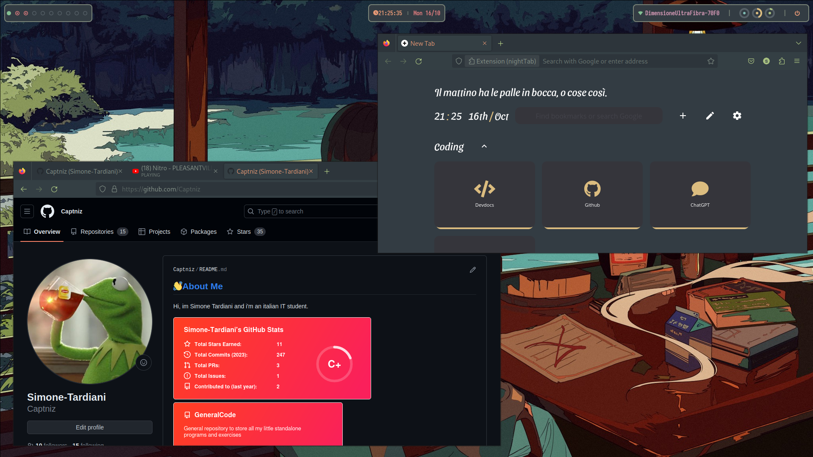

<h1 align="center"><b>[Hyprland] Arch Dots</b></h1>

<div align="center" >
Config files from my Arch - Hyprland linux daily driver, planning on eventually making this into a distro.
<br>
<br>
    
</div>

========================================================
OUTDATED OR BROKEN - Check out my other repo NixOs-dots
========================================================

## Table of Contents

- [Table of Contents](#table-of-contents)
- [Gallery](#gallery)
  - [Included themes:](#included-themes)
  - [Theme: Everforest](#theme-everforest)
- [Tips \& commands](#tips--commands)
  - [Tips](#tips)
  - [Commands](#commands)

## Gallery

### Included themes:

> [!WARNING]
> **Themes wont work out of the box**, the `ThemeChanger` app is designed to be modular, though the themes in the theme folder are designed to work on my computer.
> Making your on theme is pretty simple, just look at one of the examples and copy the configs you need; the only exception is `text` type configs, for those the `key` or `fieldname` of the json is the keyword that needs to be searched for in the file, while the `value` of the field is what to be substituted. ***THE WHOLE LINE WILL BE SUBSTITUTED*** so watch out for that, look in the themes folder for some examples.

- **Everforest** [*Dark* - *Light*]
- **Gruvbox** [*Dark* - *Light*]
- **Monochrome** [*Dark* - *Light*]

### Theme: <a src="https://github.com/sainnhe/everforest">Everforest</a>

#### Light mode <!-- omit from toc -->

<div align="center" >
    
</div>

#### Dark mode <!-- omit from toc -->

<div align="center" >
    
</div>

## Tips & commands  

### Tips

I dunno, its just pretty standard dots (0_0)

### Commands

*Check the .zshrc for aliases and .local/share/applications for scripts*

```bash
cls : clears the terminal
updateall : updates the system
wifi : shows wifi networks (nmcli)
jump : jumps to a directory
mkzip : makes a zip file
gacp : git add, commit, push
flushWifiConnections : clears wifi connections passwords and paired connections
mountall : mounts all external drives
ocr: extract text from image or pdf (tesseract)
chtheme : changes theme
```  
