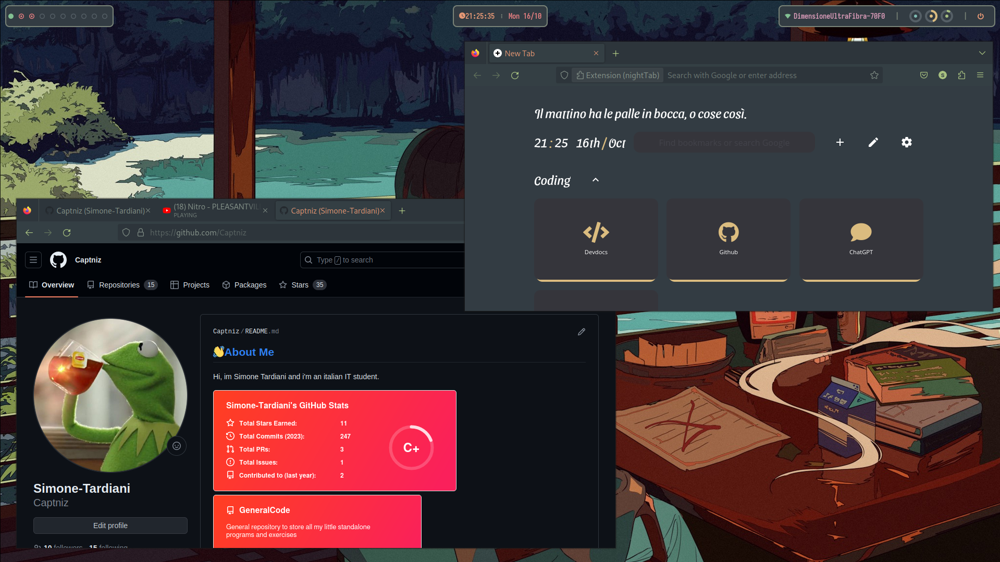

# Hyprland_Dots
Config files from my Arch - Hyprland linux daily driver, planning on eventually making this into a distro.

    

<h2 align="center">Theme: <a src="https://github.com/sainnhe/everforest">Everforest</a></h2>

## Light mode

    

## Dark mode

    

